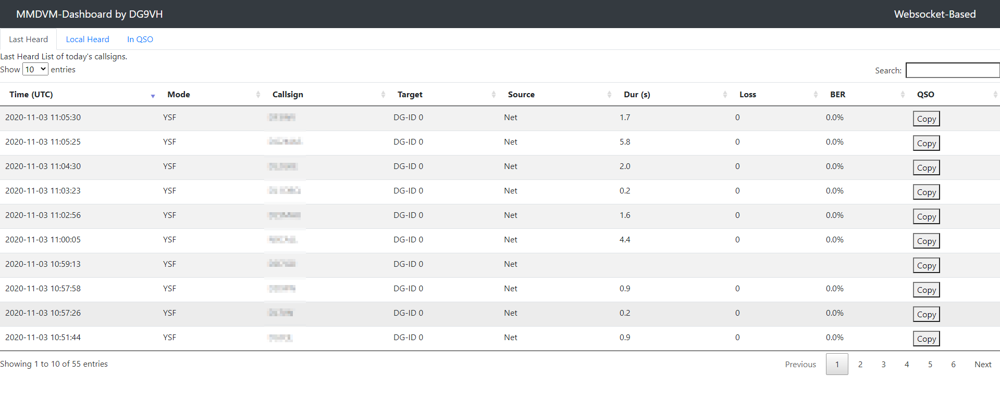

# MMDVMHost-Websocketboard

## Introduction
This is a very first development version of my new MMDVMDash using websockets-technology to get rid of high load on Raspberry Pi and others and keep those temperature down.

Also this should improve user experience.

## Installation
You'll need to install several python3 modules. A concrete list will follow here later.
Actually known:
* websockets: `sudo apt install python3-websockets`
* ansi2html: `sudo pip3 install ansi2html`

### Installation steps
* clone this repository to your home-directory with `git clone --recurse-submodules -j8 https://github.com/dg9vh/MMDVMHost-Websocketboard` to clone the repository with it's submodules
* create directory with `sudo mkdir /opt/MMDVMDash`
* change ownership to your user for example with `sudo chown -R pi /opt/MMDVMDash`
* copy all files from repository into this folder
* modify *logtailer.ini* to fit your needs
* modify */js/config.js* to fit your needs, here you can switch on/off tabs showing or enable debug for getting some output in javascript console
* copy files in */opt/MMDVMDash/systemd* to */etc/systemd/system* or similar corresponding to your system
* modify both scripts to fit your needs
* enable services with following commmands, this results in starting both automatically after reboot:
  * `sudo systemctl enable http.server.service`
  * `sudo systemctl enable logtailer.service`
* start services with following commmands:
  * `sudo systemctl start http.server.service`
  * `sudo systemctl start logtailer.service`

Finally you should be able to get the new Dashboard calling the hostname of your hotspot and port 8000 (default) in your broser

## Credits

*logtailer.py* is based on the work of http://shzhangji.com/blog/2017/07/15/log-tailer-with-websocket-and-python/

## Screenshots

